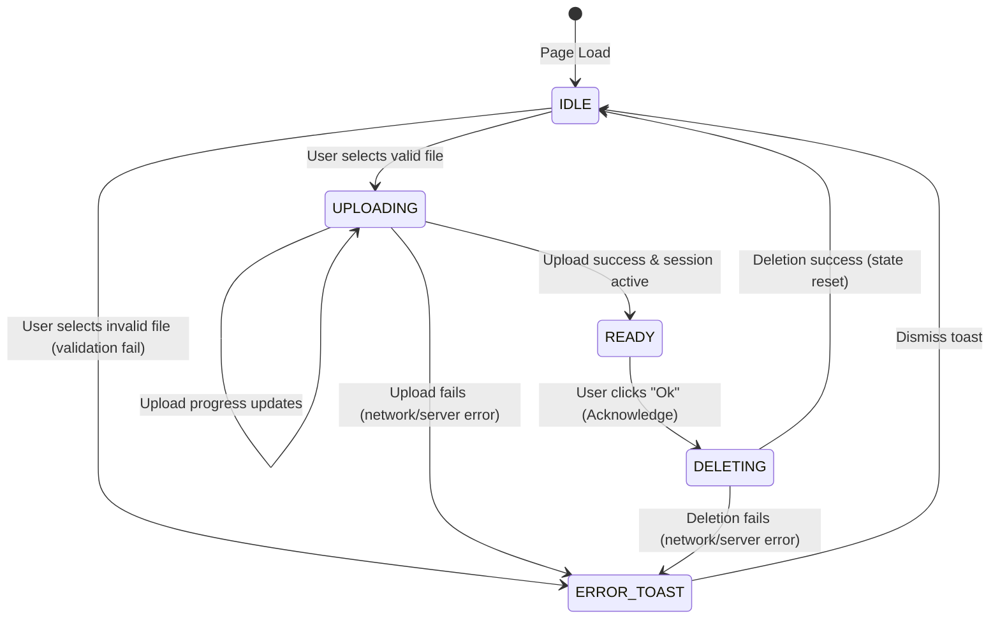

# Data Model and State Design: Sharkophagus Web UI

This document details the data structures, TypeScript models, and client-side state transitions for the Sharkophagus Web UI frontend.

---

## 1. Entities

### CaptureSession

Represents an active or closed packet analysis session. It maps to the backend `/sessions` response schema but includes client-side metadata tracking file upload progress and local file details.

```typescript
export interface CaptureSession {
  id: string; // UUID from backend
  status: 'active' | 'closed'; // Status enum
  createdAt: string; // ISO 8601 timestamp
  
  // Client-derived fields
  fileName: string; // Original uploaded file name
  fileSize: number; // File size in bytes
}
```

### CaptureStatistics

Represents the packet capture analysis results returned from the backend `/sessions/{id}/stats` endpoint.

```typescript
export interface CaptureStatistics {
  frames: number; // Total number of packets/frames
  bytes: number; // Total size in bytes
  duration: number; // Duration of capture in seconds
  firstPacketTime?: string; // ISO 8601 timestamp of first packet (optional)
  lastPacketTime?: string; // ISO 8601 timestamp of last packet (optional)
}
```

### ErrorPayload

Standard shape for error responses returned from the backend API.

```typescript
export interface ErrorPayload {
  code: string; // e.g. "BAD_REQUEST", "SHARKD_ERROR"
  message: string; // Human readable explanation
}
```

---

## 2. Client-Side Lifecycle & State Machine

The frontend dashboard transitions through various states based on user actions and API responses:



### State Definitions

- **IDLE**: Initial state. Shows the drag-and-drop file upload zone.
- **UPLOADING**: Active upload state. Shows progress indicator and disables file selection.
- **READY**: File successfully loaded. Renders the statistics dashboard view.
- **DELETING**: Session termination in progress. Disables interaction and shows loading spinner.
- **ERROR_TOAST**: Transient overlay displaying API/network failures. Can appear on top of IDLE or READY states.

---

## 3. Validation Rules

- **Allowed Extensions**: Client-side validation blocks any file not ending in `.pcap`, `.pcapng`, `.cap`, or `.dmp` (case-insensitive).
- **Extension Match Pattern**: `/^.*\.(pcap|pcapng|cap|dmp)$/i`
- **File Size limit**: Max 10MB checked client-side (backend matches this limit).
