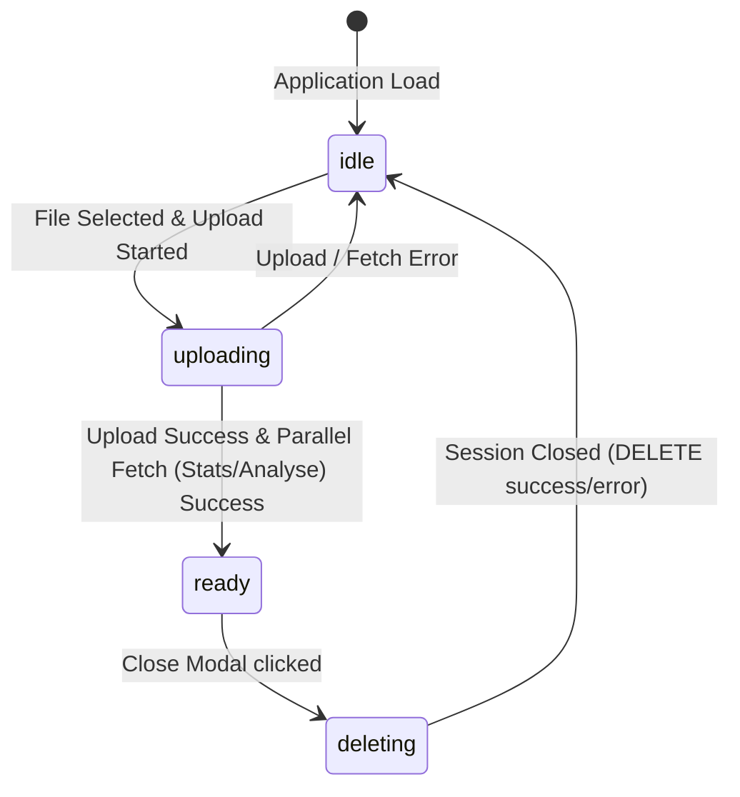

# Data Model & Types: PCAP Analyse Modal

This document describes the changes to TypeScript definitions and the frontend application state machine.

## 1. Updated API Types (`web/src/types/index.ts`)

### `CaptureAnalysis` (New Interface)

Represents the packet analysis findings from the `/sessions/{id}/analyse` endpoint.

```typescript
export interface CaptureAnalysis {
  /** Total number of frames analysed */
  frames: number;
  /** List of detected protocol names */
  protocols: string[];
  /** Start time of capture (epoch timestamp in seconds) */
  first: number;
  /** End time of capture (epoch timestamp in seconds) */
  last: number;
}
```

### `CaptureStatistics` (Updated Interface)

Updated to capture additional attributes returned by the backend stats endpoint.

```typescript
export interface CaptureStatistics {
  /** Total number of packets/frames */
  frames: number;
  /** Capture duration in seconds */
  duration: number;
  /** File size in bytes (corresponds to bytes from backend API) */
  bytes?: number;
  /** Filename of the loaded PCAP */
  filename?: string;
}
```

---

## 2. Client-Side State Machine

The reactive application lifecycle states are:



- `idle`: Dropzone is visible.
- `uploading`: Progress bar is visible. Starts fetching statistics and analysis results in parallel once the initial file upload finishes.
- `ready`: Displays the `AnalysisModal` overlay containing both statistics and analysis details.
- `deleting`: Triggers `closeSession` to terminate the session on the backend.
